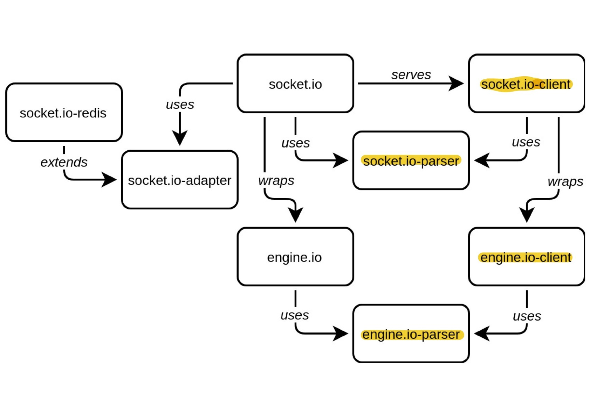

[](https://crates.io/crates/rust_socketio)
[](https://docs.rs/rust_socketio)
[](https://github.com/1c3t3a/rust-socketio/actions/workflows/build.yml)
[](https://github.com/1c3t3a/rust-socketio/actions/workflows/test.yml)
[](https://codecov.io/gh/1c3t3a/rust-socketio)

# Rust-socketio-client

An implementation of a socket.io client written in the rust programming language. This implementation currently supports revision 5 of the socket.io protocol and therefore revision 4 of the engine.io protocol. If you have any connection issues with this client, make sure the server uses at least revision 4 of the engine.io protocol.

## Example usage

Add the following to your `Cargo.toml` file:

```toml
rust_socketio = "0.4.0"
```

Then you're able to run the following example code:

``` rust
use rust_socketio::{ClientBuilder, Payload, RawClient};
use serde_json::json;
use std::time::Duration;

// define a callback which is called when a payload is received
// this callback gets the payload as well as an instance of the
// socket to communicate with the server
let callback = |payload: Payload, socket: RawClient| {
       match payload {
           Payload::Json(data) => println!("Received {:?}", data),
           Payload::Binary(bin_data) => println!("Received bytes: {:#?}", bin_data),
           Payload::Multi(vec) => println!("Received multi: {:?}", vec),
           _ => {}
       }
       socket.emit("test", json!({"got ack": true})).expect("Server unreachable")
};

// get a socket that is connected to the admin namespace
let socket = ClientBuilder::new("http://localhost:4200")
     .namespace("/admin")
     .on("test", callback)
     .on("error", |err, _| eprintln!("Error: {:#?}", err))
     .connect()
     .expect("Connection failed");

// emit to the "foo" event
let json_payload = json!({"token": 123});
socket.emit("foo", json_payload).expect("Server unreachable");

// define a callback, that's executed when the ack got acked
let ack_callback = |message: Payload, _| {
    println!("Yehaa! My ack got acked?");
    println!("Ack data: {:#?}", message);
};

let json_payload = json!({"myAckData": 123});
// emit with an ack
socket
    .emit_with_ack("test", json_payload, Duration::from_secs(2), ack_callback)
    .expect("Server unreachable");

socket.disconnect().expect("Disconnect failed")

```

The main entry point for using this crate is the `ClientBuilder` which provides a way to easily configure a socket in the needed way. When the `connect` method is called on the builder, it returns a connected client which then could be used to emit messages to certain events. One client can only be connected to one namespace. If you need to listen to the messages in different namespaces you need to allocate multiple sockets.

## Documentation

Documentation of this crate can be found up on [docs.rs](https://docs.rs/rust_socketio).

## Current features

This implementation now supports all of the features of the socket.io protocol mentioned [here](https://github.com/socketio/socket.io-protocol).
It generally tries to make use of websockets as often as possible. This means most times
only the opening request uses http and as soon as the server mentions that he is able to upgrade to
websockets, an upgrade  is performed. But if this upgrade is not successful or the server
does not mention an upgrade possibility, http-long polling is used (as specified in the protocol specs).
Here's an overview of possible use-cases:
- connecting to a server.
- register callbacks for the following event types:
    - open
    - close
    - error
    - message
    - custom events like "foo", "on_payment", etc.
- send JSON data to the server (via `serde_json` which provides safe
handling).
- send JSON data to the server and receive an `ack`.
- send and handle Binary data.

## Content of this repository

This repository contains a rust implementation of the socket.io protocol as well as the underlying engine.io protocol.

The details about the engine.io protocol can be found here:

* <https://github.com/socketio/engine.io-protocol>

The specification for the socket.io protocol here:

* <https://github.com/socketio/socket.io-protocol>

Looking at the component chart, the following parts are implemented (Source: https://socket.io/images/dependencies.jpg):



## Licence

MIT
